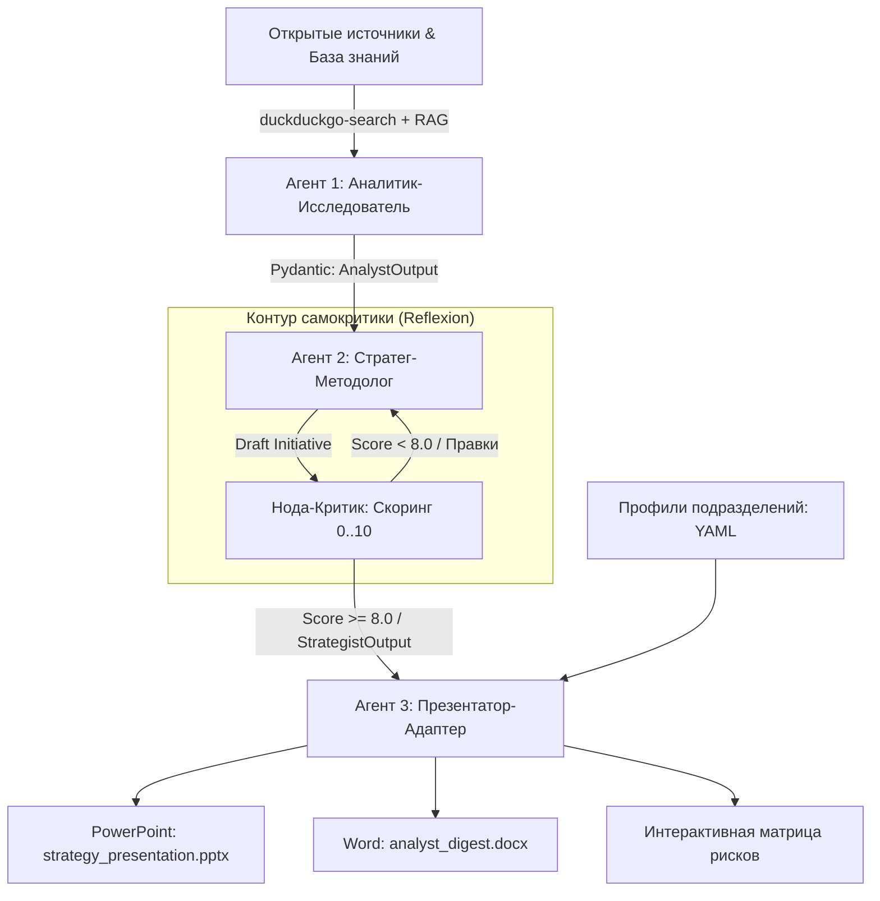

# Мультиагентная система стратегического анализа и каскадирования инициатив (ДСИиУР ПАО «Газпром нефть»)

[](https://www.python.org/downloads/)
[](https://github.com/langchain-ai/langgraph)
[](https://docs.pydantic.dev/)
[]()
[]()

> **Разработчик:** Лаврентий Ямпуров  
> **Проектная лаборатория:** ДСИиУР ПАО «Газпром нефть»  
> **Цель проекта:** Сокращение рутинного труда аналитиков на 70% и устранение «коммуникационного разрыва» (Communication Gap) между общекорпоративной стратегией компании и профильными подразделениями (Бурение, Логистика, ИТ).

---

## 🏛 Архитектура конвейера (3 сквозных агента)



### 1. Агент 1: Аналитик-Исследователь
* **Сбор и мониторинг:** Мониторинг новостей ТЭК, макроэкономики и логистики без платных API через `duckduckgo-search` (0 рублей затрат).
* **Early Warnings:** Детекция слабых сигналов и макроэкономических рисков (санкции, задержки ввода судов, изменение пошлин).
* **Выход:** Строгая Pydantic-модель `AnalystOutput` + отчеты в форматах Word (`.docx`) и Excel (`.xlsx`).

### 2. Агент 2: Стратег-Методолог
* **Синтез:** Применение методологий стратегического консалтинга (SWOT, PESTEL, матрица Ансоффа).
* **Контур самокритики (Reflexion Loop):** Валидация предложений по 4 корпоративным направлениям:
  * Санкционная уязвимость (вес 30%)
  * Окупаемость и CAPEX (вес 30%)
  * Технологическая зрелость TRL (вес 20%)
  * Промышленная безопасность и ESG (вес 20%)
* **Масштабирование на 100–1000 критериев:** Иерархическая 4-блочная кластеризация (Map-Reduce) и мгновенный отсев по жестким стоп-факторам (Red Flags).

### 3. Агент 3: Презентатор-Адаптер
* **Каскадирование:** Сопоставление стратегических инициатив с профилями подразделений (Бурение, Логистика, ИТ), их сленгом и целевыми KPI (проходка, ставка фрахта, импортозамещение).
* **Программная верстка PPTX:** Генерация презентаций через `python-pptx` по официальному мастер-шаблону с гарантией 100% соблюдения брендбука.

---

## 🔍 Инженерия данных и Advanced RAG

1. **Layout-Aware Parsing (`Docling` / `Marker`):** Распознавание сложных таблиц годовых отчетов ТЭК и их конвертация в Markdown с сохранением связей строк и колонок.
2. **Гибридный поиск (Hybrid Search):**
   $$\text{Score} = \alpha \cdot \text{Dense} + (1 - \alpha) \cdot \text{BM25}$$
   Векторный поиск (`bge-m3`) находит общий смысл, а лексический (`BM25`) гарантирует точное нахождение отраслевых терминов (ПНГ, СПГ, УВС, TRL, демередж). Слияние через **RRF (Reciprocal Rank Fusion)**.
3. **Кросс-энкодерный реранкинг (`bge-reranker-large`):** Отсечение нерелевантного шума из топ-25 до топ-5 чистейших фрагментов.
4. **Контроль галлюцинаций (Ragas Framework):** Автоматический замер метрик *Faithfulness* (> 0.95), *Answer Relevancy* (> 0.90) и *Context Precision* (> 0.85).

---

## 🚀 Готовность к On-Premise (Model-Agnostic)

Система изначально спроектирована так, чтобы переноситься во внутренний закрытый периметр компании **без изменения кодовой базы**:
* Вызовы стандартизированы через OpenAI-совместимый интерфейс (`base_url`).
* Для перехода на локальные серверы инференса (**vLLM / Ollama**) с моделями **Qwen 2.5 72B** или **Llama 3.3 70B** достаточно обновить параметры в `.env`:

```bash
# Переключение на локальный контур компании
LLM_BASE_URL="http://internal-vllm.corp.gazprom-neft.ru:8000/v1"
LLM_MODEL="qwen2.5-72b-instruct"
```

---

## 📂 Структура репозитория

```
├── src/
│   ├── agents/
│   │   ├── analyst.py             # Агент 1: сбор данных и детекция сигналов
│   │   ├── strategist.py          # Агент 2: синтез инициатив и нода критики
│   │   └── presenter.py           # Агент 3: адаптер департаментов и PPTX
│   ├── schemas/
│   │   └── contracts.py           # Строгие Pydantic v2 схемы данных
│   └── rag/
│       └── hybrid_retriever.py    # Гибридный поиск (BM25 + Dense + RRF)
├── assets/                        # Векторные русскоязычные схемы архитектуры
├── build_executive_presentation.py # Генератор стратегической презентации (21 слайд)
├── generate_docx.py               # Генератор иллюстрированного отчета (11 глав)
├── main.py                        # Главный запуск сквозного конвейера
├── requirements.txt               # Зависимости проекта
└── README.md                      # Документация
```

---

## ⚡ Быстрый старт

### 1. Установка окружения
```bash
git clone https://github.com/Lavr02/gazprom-strategy-agents.git
cd gazprom-strategy-agents
python -m venv venv
# Windows:
venv\Scripts\activate
pip install -r requirements.txt
```

### 2. Запуск сквозного конвейера
```bash
python main.py
```

### 3. Сборка презентации и полного отчета
```bash
# Генерация стратегического питч-дека на 21 слайд (McKinsey style)
python build_executive_presentation.py

# Генерация иллюстрированного аналитического отчета (1.25 МБ)
python generate_docx.py
```

---

## 👤 Автор и контакты

**Лаврентий Ямпуров**  
* Магистрант НИУ ИТМО (Инноватика, «Технологии и стратегии бизнес-трансформации»)
* Руководитель проектов цифровой трансформации в тяжелой промышленности (ВГК: агенты ТОиР, предиктивные контуры)
* **Telegram:** [@Lavr02](https://t.me/Lavr02)
* **Email:** ylv30072002@mail.ru
* **Телефон:** +7 (981) 167-82-36
